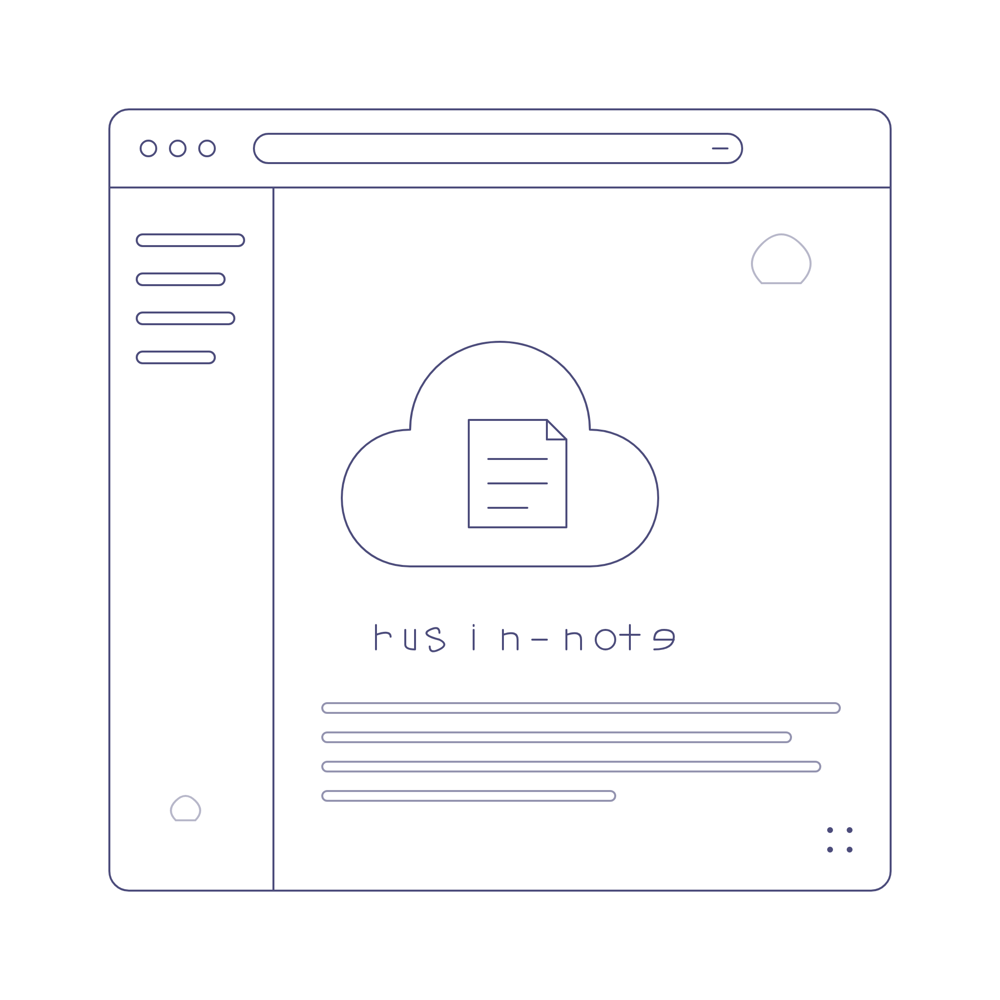

> [!IMPORTANT]
>
> 注：如果您是 rusin-dev（本组织）的成员，想要贡献，请参见[协作指南](https://github.com/rusin-dev/rusin-note?tab=contributing-ov-file)并查看 [todo](https://github.com/rusin-dev/rusin-note/blob/main/docs/todo.md)，如果您不是本组织的，可以加入或开个 Issue。

<div align="center">
    <a href="https://github.com/rusin-dev/rusin-note"></a>
    <h1><b>Rusin-Note</b></h1>
    <p><em>🖊︎ 一个受 note.ms 启发的轻量级云端剪贴板项目，支持 VPS 与无服务器（Serverless）部署，开箱即用。</em></p>
    <p>
        简体中文 | <a href="https://github.com/rusin-dev/rusin-note/blob/main/README_en.md">English</a> | <a href="https://note.rusin7.com">Demo</a>
    </p>
    <p align="center">
        <a href="https://github.com/rusin-dev/rusin-note/blob/main/LICENSE"></a>
        <a href="https://github.com/rusin-dev/rusin-note/releases"></a>
        <a href="https://github.com/rusin-dev/rusin-note/releases"></a>
        <a href="https://github.com/rusin-dev/rusin-note/stargazers"></a>
        <a href="https://github.com/rusin-dev/rusin-note/network/members"></a>
        <a href="https://github.com/rusin-dev/rusin-note/actions/workflows/check.yml">
        </a>
        <a href="https://github.com/rusin-dev/rusin-note/actions/workflows/auto-merge.yml">
        </a>
        <a href="https://www.python.org/downloads/"></a>
        <a href="https://www.repostatus.org/#active"></a>
    </p>
</div>


## 产品特性

- **云端剪贴板与笔记**：基于 Flask 的轻量实现，浏览器即可快速保存 / 访问文本；支持随机短链的公开笔记与登录用户的私有笔记；可为笔记生成带随机 token 的分享链接并支持内容写回，便于跨设备协作。
- **Markdown 渲染**：经 Bleach 安全清洗的 Markdown，支持 KaTeX 公式、代码高亮（服务端 Pygments + 客户端 highlight.js 兜底，跟随亮/暗主题）、GitHub 风格提示卡片（`> [!NOTE]` 等，可折叠）、标题锚点深链与大纲目录（宽屏侧栏 / 窄屏抽屉），编辑页可开关实时预览。
- **笔记组织**：标签（自动补全 + 列表筛选）、文件夹、置顶，以及批量导入 / 导出（ZIP 或单文件 Markdown，同名跳过不覆盖）；编辑页输入 `#` 可快捷引用自己的笔记。
- **图床与附件**：粘贴 / 拖拽上传图片（PNG / JPEG / GIF / WebP，魔数校验，公开可读）与任意文件附件（扩展名黑名单 + 配额）；附件默认仅登录用户可下载，并有单用户并发闸门防止慢速长连接霸占 worker。
- **评论与犇犇动态**：笔记 / 分享页评论（可匿名、冷却、分页）；内置持久化轻量动态流犇犇，登录可发布、未登录可浏览。
- **首页工作台**：登录后展示最近编辑笔记与待办清单，顶部公告横幅读取仓库根目录 `NOTICE.txt` 首行。
- **组织 / 团队协作**：Owner / Admin / Member 三级角色，邀请码 / 公开 / 审批三种加入方式；组织笔记独立存储，与个人笔记完全隔离；团队简介支持 Markdown 与 LaTeX（`$...$` / `$$...$$`）渲染。
- **账号与登录安全（可选）**：GitHub / Google / Microsoft / 微信 / QQ 第三方登录（OAuth 2.0，总开关默认关闭）、基于 TOTP 的两步验证（含一次性恢复码）、邮箱 / 手机号验证与验证码免密登录；均可在 `/admin/features` 独立启停。
- **多语言与个性化**：内置简体中文 / English（手动切换或按浏览器语言自动选择）；用户设置页支持简洁模式、修改密码、修改用户名（全部数据自动迁移）。
- **功能开关（Feature Flags）**：管理员在 `/admin/features` 用滑块即时启停各功能，保存后立即生效、无需重启；停用功能入口自动隐藏、路由 404。
- **插件系统**：投放 `*.plugin.zip` 到运行时目录即自动解压安装并加载其中的 Flask 蓝图，支持上游自动更新（无服务器只读环境不支持）。详见 [插件系统](docs/plugins.md)。
- **部署友好 + 基础防护完善**：配置集中在 `config.json`，数据后端可插拔（sqlite / file / upstash / postgres / memory）；内置 CSRF 防护、多维 IP 限流、防 `X-Forwarded-For` 伪造、内容安全清洗，以及可选的 nginx + ModSecurity 反向代理 WAF。

> 各能力的对应开关、配额与限制逐项说明见 [配置项详解](docs/configuration.md)。

## 快速开始

### 要求

Python 版本 $\geq$ 3.10。

### 本地开发

```bash
git clone https://github.com/rusin-dev/rusin-note.git
cd rusin-note
pip install -r requirements.txt
python3 -m app          # Windows 下为 python -m app；端口由环境变量 PORT 控制，默认 8080
```

打开 <http://localhost:8080> 查看效果。本地默认使用 `sqlite` 存储后端，数据落盘于 `RUSIN_DATA_DIR`（默认 `data/`）。

### 开发与测试

```bash
pip install -r requirements-dev.txt     # 安装 pytest（已包含 requirements.txt）
pytest tests/                           # 全部端到端测试（自动隔离临时数据目录，不污染本地数据）
pytest tests/test_org.py -q             # 单个模块；按关键字筛选：pytest tests/ -q -k images
python tests/frontend_check.py          # 前端语法检查（Jinja2 + 内联 CSS/JSON；有 Node 时校验内联 JS）
```

- 测试统一用 **pytest + logging** 组织：`tests/conftest.py` 固定 `RUSIN_STORAGE=file`、切到临时 `RUSIN_DATA_DIR` 并清空内存缓存，不会污染本地数据；完整约定见 `tests/README.md`。
- 前端资源全部内联在 Jinja2 模板中（无独立 JS/CSS 文件），改动模板后请运行 `python tests/frontend_check.py`。
- CI（`.github/workflows/check.yml`）在 push / PR 到 `dev` 分支时按变更范围触发 `frontend`（前端语法检查）与 `test`（pytest + HTTP 健康检查）两个 job。

## 部署

各平台的完整步骤已拆分到 `docs/deployment/`。先阅读[部署总览](docs/deployment/index.md)（含 SECRET_KEY 获取方法、常用环境变量、代理与 Cookie 默认值），再选择对应方式：

| 方式 | 适用场景 | 指南 |
|---|---|---|
| **Vercel** | 无服务器推荐，绑定 Neon（PostgreSQL）即得持久化 | [docs/deployment/vercel.md](docs/deployment/vercel.md) |
| **AWS Lambda** | 无服务器，需要信用卡，不推荐 | [docs/deployment/aws-lambda.md](docs/deployment/aws-lambda.md) |
| **VPS / 传统服务器** | 自有服务器，gunicorn + Nginx 反代 | [docs/deployment/vps.md](docs/deployment/vps.md) |
| **Zeabur** | GitHub 自动部署，需挂载持久化卷（可选 Redis） | [docs/deployment/zeabur.md](docs/deployment/zeabur.md) |

部署相关进阶主题：

- 存储后端（sqlite / file / upstash / postgres / memory）的启用方式与自动识别 → [存储后端说明](docs/deployment/storage-backends.md)
- 反向代理下取真实客户端 IP、防 XFF 伪造与 IP 黑白名单 → [真实客户端 IP 与防 XFF 伪造](docs/deployment/ip-and-proxy.md)
- 在应用前置 nginx + ModSecurity + OWASP CRS 拦截攻击流量 → [反向代理 WAF](docs/deployment/waf.md)

## 文档索引

| 文档 | 内容 |
|---|---|
| [部署总览](docs/deployment/index.md) | 各平台部署入口、SECRET_KEY、环境变量、代理默认值 |
| [存储后端说明](docs/deployment/storage-backends.md) | 五种后端启用方式与自动识别优先级 |
| [配置项详解](docs/configuration.md) | `config.json` 全部配置项、默认值与安全说明、`RUSIN_*` 环境变量 |
| [真实客户端 IP 与防 XFF 伪造](docs/deployment/ip-and-proxy.md) | 可信代理校验、XFF 右起解析、IP 名单 |
| [反向代理 WAF](docs/deployment/waf.md) | OWASP CRS 供给、nginx + ModSecurity 配置、误报处理 |
| [插件系统](docs/plugins.md) | 插件包结构、加载与更新流程、安全注意 |
| [协作指南](docs/CONTRIBUTING.md) | 贡献流程 |
| [免责声明](docs/Disclaimer.md) | 使用条款 |

## 项目结构

```plaintext
rusin-note/
├─ config.json          配置项（详见 docs/configuration.md）
├─ NOTICE.txt           首页公告横幅内容（取第一个非空行）
├─ README.md / README_en.md
├─ requirements.txt / requirements-dev.txt / pytest.ini
├─ vercel.json          Vercel 无服务器部署配置
├─ lambda_handler.py    AWS Lambda 入口（Mangum）
├─ .env.example         环境变量示例
│
├─ api/                 无服务器入口（Vercel Python 入口）
├─ app/                 应用
│  ├─ __init__.py       Flask app 工厂 create_app
│  ├─ __main__.py       开发入口：python3 -m app
│  ├─ wsgi.py           WSGI 入口（gunicorn）
│  ├─ core/             共享内核：storage / store / auth / middleware / ip_utils /
│  │                    concurrency / captcha / feature_flags / plugins / waf /
│  │                    totp / notes / tags / folders / pins / prefs / cleanup / i18n …
│  ├─ apps/             功能 App（各带 views.py 蓝图，业务逻辑放 service.py）
│  │  └─ registry.py    按序注册全部 App 蓝图（含插件与 catch-all world_short）
│  └─ static/           内置静态资源（logo / 图片）
│
├─ templates/           Jinja2 模板（前端 CSS/JS 全部内联，中英双语）
├─ tests/               pytest 端到端测试 + frontend_check.py 前端语法检查
├─ docs/                文档（deployment/ 部署指南、配置详解、插件、协作、免责声明）
└─ .github/             ISSUE_TEMPLATE 与 workflows（check / codeql / release / 同步…）
```

架构分层：共享内核 `app/core/`（基础设施 + 跨功能领域服务）与功能 App `app/apps/<feature>/`（自带 `views.py` 蓝图与可选 `service.py`）；所有业务模块只通过 `app/core/storage.py` 的统一 `storage` 接口访问数据，后端可插拔。详细的模块职责、路由表与配置项说明，请参考 Skill：`.opencode/skills/rusin-note-codebase/SKILL.md`。
